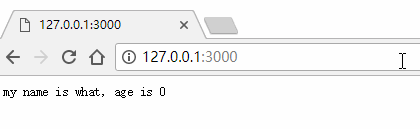

# koa-router路由中间件

---

## 安装

koa-router GitHUB 地址：https://github.com/alexmingoia/koa-router

>npm install koa-router --save

安装成功后在 package.json 文件就可以看到 koa-router 了

``` json
"dependencies": {
    "koa": "^2.5.0",
    "koa-router": "^7.4.0"
}
```

## 基础使用


``` javascript
const Koa = require('koa')
const Router = require('koa-router') // 引入 koa-router

const app = new Koa()
const router = new Router() // new 出一个 router 对象

// 设置路由
router.get('/', async (ctx, next) => { // 当配置多页面路由时， next 参数数必须的
    ctx.body = 'Home page'
}).get('/xxy', (ctx, next) => {
    ctx.body = 'xxy page'
})

// 装载路由
app
    .use(router.routes())
    .use(router.allowedMethods());

app.listen(3000, () => {
    console.log('koa-router starting at port 3000');
})
```

## 设置路径前缀

上面配置的路由默认访问是 `http://127.0.0.1:3000/xxy`，现在需要给路径前面再加上一个 `article` 前缀，路径变成 `http://127.0.0.1:3000/article/xxy`

***设置全局路径前缀***

只要修改原来的 new 出一个 router 对象里面传参就可以了，如：

``` javascript
const router = new Router({
    prefix: '/article'
})
```

***设置单独页面路径前缀***

``` javascript
const Koa = require('koa')
const Router = require('koa-router')

const app = new Koa()

// 子路由1
let home = new Router()
home.get('/', async (ctx, next) => {
    ctx.body = 'Home page'
}).get('/xxy', async (ctx, next) => {
    ctx.body = 'Xxy page'
})

// 子路由2
let list = new Router()
list.get('/page1', async (ctx, next) => {
    ctx.body = 'page1 '
}).get('/page2', async (ctx, next) => {
    ctx.body = 'page2'
})

// 装载所有子路由
let router = new Router()
router.use('', home.routes(), home.allowedMethods()) // 没有路径前缀的路由
router.use('/list', list.routes(), list.allowedMethods()) // 有路径前缀的路由

// 加载路由中间件
app
    .use(router.routes())
    .use(router.allowedMethods())
    
app.listen(3000, () => {
    console.log('koa-router starting at port 3000');
})
```

## 路由传递参数

在需要接受参数的路由中使用上下文对象中的 [ctx.query](./Context%E5%AF%B9%E8%B1%A1.md#ctxrequest-%E5%AF%B9%E8%B1%A1%E5%8C%85%E6%8B%AC%E4%BB%A5%E4%B8%8B%E5%B1%9E%E6%80%A7%E5%92%8C%E5%88%AB%E5%90%8D%E6%96%B9%E6%B3%95) 就可以了

示例：

``` javascript
router.get('/', async (ctx, next) => {
    // ctx.body = ctx.query
    let query = ctx.query
    let name = query.name ? query.name : 'what'
    let age = query.age ? query.age : 0
    ctx.body = `my name is ${name}, age is ${age}`
})
``` 
效果：

