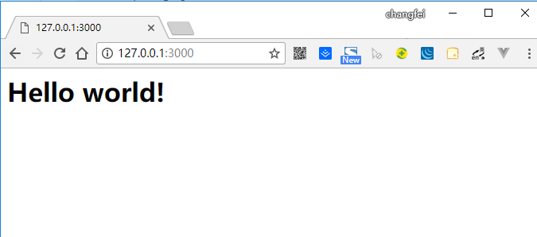

# Koa2快速开始

## 环境需求

Koa 依赖 node v7.6.0 或 ES2015及更高版本和 async/await 方法支持，所以 node.js 环境都要 7.6.0 以上


## 安装

1. 初始化

```
npm init -y
```

2. 安装 Koa2
```
npm install koa
```

## 第一个 Hello World

在根目录新建一个 helloWorld.js

代码：
``` javascript
// 导入koa，在koa2中，导入的是一个 class，因此用大写的 Koa 表示:
const Koa = require('koa');

// 创建一个Koa对象表示web app本身:
const app = new Koa();

// 对于任何请求，app 将调用该异步函数处理请求：
app.use(async(ctx) => {
    ctx.body = '<h1>Hello world!</h1>'
})

// 在端口3000监听:
app.listen(3000);

// 控制台输出 log
console.log('[Demo]: koa starting at port 3000');
```

## 启动服务

在命令行工具里输入
``` node
node helloWorld.js
```

访问 http://127.0.0.1:3000 ，结果如下：


