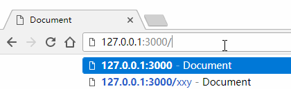

# koa原生路由

## 获取 url

通过 Context 上下文对象获取当前页面的 url

``` javascript
const Koa = require('koa');
const app = new Koa();

app.use(async ctx => {
    // 获取 url
    let url = ctx.request.url;
    // 页面输出 url
    ctx.body = url;
})

app.listen(3000);

```

运行 `node route.js`

在地址栏中输入 `http://127.0.0.1:3000/xxy`

这时页面中输出 `/xxy`，这就是当前页面的 url。

## 实现原生路由

在根目录下建立 view 文件夹，该文件夹下分别 index.html、xxy.html、404.html

``` javascript
const Koa = require('koa');
const fs = require('fs'); // 引入fs模块来读取文件
const app = new Koa();

function render(page) {
    return new Promise((resolve, reject) => {
        let url = `./view/${page}`;
        fs.readFile(url, 'binary', (err, data) => {
            if (err) {
                reject(err)
            } else {
                resolve(data)
            }
        })
    })
}

async function route(url) {
    let view = '404.html'; // 默认 404.html，即：当找不到对应页面时，返回404
    switch(url) {
        case '/':
            view = 'index.html'
        break

        case '/xxy':
            view = 'xxy.html'
        break

        case '/404':
            view = '404.html'
        break

        default:
            break
    }
    let html = await render(view);
    return html;
}

app.use(async ctx => {
    let url = ctx.request.url;
    let html = await route(url);
    ctx.body = html;
})

app.listen(3000);
console.log('[route] starting at port 3000');
```

启动服务后，在地址栏中输入不同的 url，就会进入相应的页面


