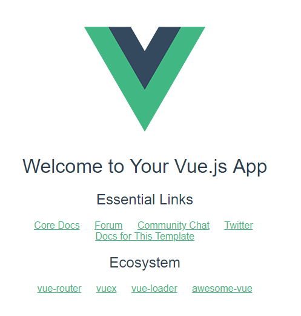

# Vue.js入门

>从 Vue.js 的安装开始，一步步记录入门使用 Vue.js 的过程。

## 目录
- [安装 Vue-cli](#安装vue-cli)
- [Vue-cli目录结构和文件说明](#vue-cli目录结构和文件说明)

---

### 安装Vue-cli


1. 使用命令行工具全局安装 Vue-cli
```
npm install -g Vue-cli
```
>这里可以使用 cnpm 来安装，即：[淘宝镜像](https://npm.taobao.org/)
    
安装完成后可以使用 `vue -V` (V 是大写的)来检查 Vue-cli 的版本号。

2. 初始化 Vue-cli

初始化之前，先创建一个目录，这个目录时用来存放 Vue-cli 初始化后的项目用的。

如果不创建一个新目录，当使用初始化命令时，Vue-cli 就会在所在目录下直接以项目名称创建一个目录


```
mkdir vue-demo
```
**可以省略创建目录这一步，直接进入需要安装 Vue-cli 的目录即可**

开始初始化
```
vue init <template-name> <project-name>
````
init：表示用 vue-cli 来初始化项目

\<template-name\>：表示模板名称，vue-cli 官方提供了5种模板

```
webpack – 一个全面的 webpack + vue-loader 的模板，功能包括热加载，linting 检测和 CSS 扩展。

webpack-simple – 一个简单 webpack + vue-loader 的模板，不包含其他功能，让你快速的搭建 vue 的开发环境。

browserify – 一个全面的 Browserify + vueify 的模板，功能包括热加载，linting 单元检测。

browserify-simple – 一个简单 Browserify + vueify 的模板，不包含其他功能，让你快速的搭建 vue 的开发环境。

simple – 一个最简单的单页应用模板。
```
\<project-name\>：标识项目名称，这个可以根据自己的项目来起名字。

输入命令后，会询问我们几个简单的选项，根据需要进行填写。

```
Project name：项目名称 ，如果不需要更改直接回车就可以了。注意：这里不能使用大写

Project description：项目描述，默认为A Vue.js project，直接回车，不用编写。

Author：作者，如果你有配置 git 的作者，他会读取。

Install  vue-router？ 是否安装 vue 的路由插件

Use ESLint to lint your code？ 是否用 ESLint 来限制你的代码错误和风格。如不需要输入 n，如果是大型团队开发，最好是进行配置。

setup unit tests with  Karma + Mocha？ 是否需要安装单元测试工具 Karma+Mocha。如不需要，所以输入 n。

Setup e2e tests with Nightwatch？ 是否安装e2e来进行用户行为模拟测试。如不需要，所以输入 n。
```

到了这里已经可以运行 Vue-cli 了，当中命令行中输入下列代码
```
cd vue-demo01
npm run dev
```

如果一切顺利，在命令行工具里可以看到 `I  Your application is running here: http://localhost:8080` 这句话了，直接在浏览器中输入 `http://localhost:8080` 就可以看到一个 Vue 的欢迎界面了。



**但在这之前建议先安装一下项目依赖**

3. 安装项目依赖

```
npm install
```
如果使用 `npm` 无法安装成功，可以使用 `cnpm` 来安装，最后开始运行项目 `npm run dev`。

[Go To Top](#vuejs入门)

### Vue-cli目录结构和文件说明

- 项目结构
```
├── build --------------------------------- webpack 相关配置文件
│   ├── build.js -------------------------- webpack 打包配置文件
│   ├── check-versions.js ----------------- 检查 npm,nodejs 版本
│   ├── dev-client.js --------------------- 设置环境，热重载相关
│   ├── dev-server.js --------------------- 构建本地服务器（创建 express 服务器），配置中间件，启动可热重载的服务器，用于开发项目
│   ├── utils.js -------------------------- 构建工具相关：配置资源路径，配置 css 加载器
│   ├── vue-loader.conf.js ---------------- 配置 css 加载器等
│   ├── webpack.base.conf.js -------------- webpack 基本配置
│   ├── webpack.dev.conf.js --------------- 用于开发的 webpack 设置
│   ├── webpack.prod.conf.js -------------- 用于打包的 webpack 设置
├── config -------------------------------- 配置文件
│   |--- dev.env.js ----------------------- 开发环境变量
│   |--- index.js ------------------------- 项目一些配置变量
│   |--- prod.env.js ---------------------- 生产环境变量
│   |--- test.env.js ---------------------- 测试环境变量
├── node_modules -------------------------- 存放依赖的目录
├── src ----------------------------------- 源码
│   ├── assets ---------------------------- 静态文件
│   ├── components ------------------------ vue 公共组件 
│   ├── main.js --------------------------- 程序入口文件，加载各种公共组件
│   ├── App.vue --------------------------- 项目入口组件
│   ├── router ---------------------------- 路由
├── static -------------------------------- 静态文件，比如一些图片，json 数据等
│   |-- data ------------------------------ 群聊分析得到的数据用于数据可视化
├── package.json -------------------------- node 配置文件
├── .babelrc ------------------------------ ES6 语法编译配置
├── .editorconfig ------------------------- 编辑器配置，定义代码风格
├── .gitignore ---------------------------- 配置 git 可忽略的文件
├── index.html ---------------------------- 入口页面
├── package.json -------------------------- 项目基本信息
```

- 主要配置文件说明
1. [package.json](#packagejson) ：node配置文件
2. [config/dev-server.js](#configdev-serverjs) ：构建本地服务器（创建 express 服务器），配置中间件，启动可热重载的服务器，用于开发项目
3. [build/build.js](#buildbuildjs)：webpack 打包配置文件
4. [build/webpack.base.confg.js](#buildwebpack.base.confgjs) ：webpack 基本配置
5. [build/webpack.dev.conf.js](#buildwebpackdevconfjs) ：用于开发的 webpack 设置
6. [build/webpack.prod.conf.js](#buildwebpack.prodconfjs) ：用于打包的webpack设置
7. [config/index.js](#configindexjs) ：打包时使用的配置
8. [babelrc](#babelrc) ：ES6 语法编译配置
9. [editorconfig](#editorconfig) ：编辑器配置，定义代码风格

#### package.json

package.json 文件是项目根目录下的一个文件，定义该项目开发所需要的各种模块以及一些项目配置信息（如项目名称、版本、描述、作者等）。

package.json 里的scripts字段，这个字段定义了你可以用npm运行的命令。
``` javascript
"scripts": {
    "dev": "node build/dev-server.js",  // 当我们执行 npm run dev 时，首选执行的是 dev-server.js
    "start": "node build/dev-server.js",  // 当我们执行 npm run start 时，首选执行的是 dev-server.js
    "build": "node build/build.js"  // 当我们执行 npm run build 时，首选执行的是 build.js
},
```
在开发环境下，在命令行工具中运行 npm run dev 就相当于执行 node build/dev-server.js  ，也就是开启了一个node写的开发行建议服务器。由此可以看出script字段是用来指定npm相关命令的缩写。

**dependencies 字段和 devDependencies 字段**

>dependencies：字段指项目运行时所依赖的模块；
devDependencies：字段指定了项目开发时所依赖的模块；

在命令行中运行 `npm install` 命令，会自动安装 dependencies 和 devDempendencies 字段中的模块。

#### config/dev-server.js

>引入配置文件
引入相关插件
创建express实例
配置webpack-dev-middleware和webpack-hot-middleware
配置静态资源路径，并挂到express服务上
启动服务器，并判断是否自动打开默认浏览器
监听端口

``` javascript
// 检查 Node 和 npm 版本
require('./check-versions')()
// 获取 config/index.js 的默认配置
var config = require('../config')
// 检查Node的环境变量，如果 Node 的环境无法判断当前是 dev / product 环境，则使用 config.dev.env.NODE_ENV 作为当前的环境
if (!process.env.NODE_ENV) {
    process.env.NODE_ENV = JSON.parse(config.dev.env.NODE_ENV)
}

//opn -- A better node-open. Opens stuff like websites, files, executables. Cross-platform.
// 这里用来打开默认浏览器，打开 dev-server 监听的端口 
// 一个可以强制打开浏览器并跳转到指定 url 的插件
var opn = require('opn')
// 使用 NodeJS 自带的文件路径工具
var path = require('path')
// 使用 express
var express = require('express')
// 使用 webpack
var webpack = require('webpack')
//express 中间件，用于 http 请求代理到其他服务器 // 使用 proxyTable
var proxyMiddleware = require('http-proxy-middleware')
// 判断当前环境，选择导入的 webpack 配置
// 使用 dev 环境的 webpack 配置
var webpackConfig = process.env.NODE_ENV === 'testing' ?
    require('./webpack.prod.conf') :
    require('./webpack.dev.conf')

// default port where dev server listens for incoming traffic
// 默认的 dev-server 的监听端口
// 如果没有指定运行端口，使用 config.dev.port 作为运行端口
var port = process.env.PORT || config.dev.port
// automatically open browser, if not set will be false
//是否自动打开浏览器，默认是false
var autoOpenBrowser = !!config.dev.autoOpenBrowser
// Define HTTP proxies to your custom API backend
// https://github.com/chimurai/http-proxy-middleware
// 定义 http 代理到你的自定义的 API 后端
// 使用 config.dev.proxyTable 的配置作为 proxyTable 的代理配置
var proxyTable = config.dev.proxyTable
// 创建 express 实例
// 使用 express 启动一个服务
var app = express()
// 根据 webpack 的 config 创建 Compiler 对象
// 启动 webpack 进行编译
var compiler = webpack(webpackConfig)

// 使用 compiler 相应的文件进行编译和绑定，编译后的内容将存放在内存中
// 启动 webpack-dev-middleware，将编译后的文件暂存到内存中
var devMiddleware = require('webpack-dev-middleware')(compiler, {
    publicPath: webpackConfig.output.publicPath,
    quiet: true
})
// 用于实现热重载
// 启动 webpack-hot-middleware，也就是我们常说的 Hot-reload
var hotMiddleware = require('webpack-hot-middleware')(compiler, {
    log: false,
    heartbeat: 2000
})
// force page reload when html-webpack-plugin template changes
//当html-webpack-plugin提交页面之后，使用热重载强制页面重载
compiler.plugin('compilation', function (compilation) {
    compilation.plugin('html-webpack-plugin-after-emit', function (data, cb) {
        hotMiddleware.publish({
            action: 'reload'
        })
        cb()
    })
})

// proxy api requests
// 在 express 上使用代理表中的配置
// 将 proxyTable 中的请求配置挂在到启动的 express 服务上
Object.keys(proxyTable).forEach(function (context) {
    var options = proxyTable[context]
    if (typeof options === 'string') {
        options = {
            target: options
        }
    }
    app.use(proxyMiddleware(options.filter || context, options))
})

// handle fallback for HTML5 history API
// 一个解决单页的重定向错误的插件
// 使用 connect-history-api-fallback 匹配资源，如果不匹配就可以重定向到指定地址
app.use(require('connect-history-api-fallback')())

// serve webpack bundle output
// 使用 devMiddleware，webpack 编译后的文件将挂到 express 服务器上
// 将暂存到内存中的 webpack 编译后的文件挂在到 express 服务器上
app.use(devMiddleware)

// enable hot-reload and state-preserving
// compilation error display
// 使用热重载中间件
app.use(hotMiddleware)

// serve pure static assets
// 配置静态资源路径
// 拼接 static 文件夹的静态资源路径
var staticPath = path.posix.join(config.dev.assetsPublicPath, config.dev.assetsSubDirectory)
// 将静态文件挂到 express 服务器上
// 为静态资源提供响应服务
app.use(staticPath, express.static('./static'))
//设置应用的url
var uri = 'http://localhost:' + port

var _resolve
var readyPromise = new Promise(resolve => {
    _resolve = resolve
})

console.log('> Starting dev server...')
//devMiddleware valid之后，启动服务
devMiddleware.waitUntilValid(() => {
    console.log('> Listening at ' + uri + '\n')
    // when env is testing, don't need open it
    //如果设置为自动打开浏览器，通过opn打开uri
    if (autoOpenBrowser && process.env.NODE_ENV !== 'testing') {
        opn(uri)
    }
    _resolve()
})
//监听配置的端口
var server = app.listen(port)

module.exports = {
    ready: readyPromise,
    close: () => {
        server.close()
    }
}
```

#### build/webpack.base.confg.js

>配置编译入口和输出路径
模块resolve的规则
配置不同类型模块的处理规则

``` javascript
var path = require('path')
var utils = require('./utils')
var config = require('../config')
var vueLoaderConfig = require('./vue-loader.conf')
// 绝对路径
function resolve(dir) {
    return path.join(__dirname, '..', dir)
}

module.exports = {
    // webpack 的入口文件
    entry: {
        app: './src/main.js'
    },
    output: {
        // webpack 输出文件的路径
        path: config.build.assetsRoot,
        //输出的文件命名格式
        filename: '[name].js',
        // webpack 编译输出的发布路径
        publicPath: process.env.NODE_ENV === 'production' ?
            config.build.assetsPublicPath :
            config.dev.assetsPublicPath
    },
    // 模块 resolve 的规则
    resolve: {
        //resolve的后缀名
        extensions: ['.js', '.vue', '.json'],
        // 配置路径别名，比如：import Vue from 'vue/dist/vue.common.js'--> import Vue from 'vue'
        alias: {
            'vue$': 'vue/dist/vue.esm.js',
            '@': resolve('src')
        }
    },
    // 配置不同类型模块的处理规则
    module: {
        rules: [
            // src 和 test 文件夹下的.js 和 .vue 文件使用 eslint-loader
            {
                test: /\.(js|vue)$/,
                loader: 'eslint-loader',
                enforce: 'pre',
                include: [resolve('src'), resolve('test')],
                options: {
                    formatter: require('eslint-friendly-formatter')
                }
            },
            // 所有的 .vue 文件使用 vue-loader
            {
                test: /\.vue$/,
                loader: 'vue-loader',
                options: vueLoaderConfig
            },
            // src 和 test下的 .js 文件使用 babel-loader
            {
                test: /\.js$/,
                loader: 'babel-loader',
                include: [resolve('src'), resolve('test')]
            },
            // 所有的图片文件使用 url-loader
            {
                test: /\.(png|jpe?g|gif|svg)(\?.*)?$/,
                loader: 'url-loader',
                options: {
                    limit: 10000,
                    name: utils.assetsPath('img/[name].[hash:7].[ext]')
                }
            },
            // 所有的音频文件使用 url-loader
            {
                test: /\.(mp4|webm|ogg|mp3|wav|flac|aac)(\?.*)?$/,
                loader: 'url-loader',
                options: {
                    limit: 10000,
                    name: utils.assetsPath('media/[name].[hash:7].[ext]')
                }
            },
            // 所有的字体文件使用 url-loader
            {
                test: /\.(woff2?|eot|ttf|otf)(\?.*)?$/,
                loader: 'url-loader',
                options: {
                    limit: 10000,
                    name: utils.assetsPath('fonts/[name].[hash:7].[ext]')
                }
            }
        ]
    }
}
```

#### build/webpack.dev.conf.js

>合并基础的webpack配置
使用styleLoaders
配置Source Maps
配置webpack插件

``` javascript
var utils = require('./utils')
var webpack = require('webpack')
var config = require('../config')
var merge = require('webpack-merge')
var baseWebpackConfig = require('./webpack.base.conf')
// 生成 html 文件并自动注入依赖文件的插件， script & link
var HtmlWebpackPlugin = require('html-webpack-plugin')
// 一个输出 webpack 警告，错误的插件
var FriendlyErrorsPlugin = require('friendly-errors-webpack-plugin')

// add hot-reload related code to entry chunks
// 添加热重载相关的代码到 entry chunks
Object.keys(baseWebpackConfig.entry).forEach(function (name) {
    baseWebpackConfig.entry[name] = ['./build/dev-client'].concat(baseWebpackConfig.entry[name])
})
// 合并 webpack.base.conf
module.exports = merge(baseWebpackConfig, {
    module: {
        //使用styleLoaders处理样式文件
        rules: utils.styleLoaders({
            sourceMap: config.dev.cssSourceMap
        })
    },
    // cheap-module-eval-source-map is faster for development
    // 配置 Source Maps

    devtool: '#cheap-module-eval-source-map',
    // 配置 webpack 插件
    plugins: [
        new webpack.DefinePlugin({
            'process.env': config.dev.env
        }),
        // https://github.com/glenjamin/webpack-hot-middleware#installation--usage
        new webpack.HotModuleReplacementPlugin(),
        // 在编译出现错误时，使用 NoEmitOnErrorsPlugin 来跳过输出阶段。这样可以确保输出资源不会包含错误。
        new webpack.NoEmitOnErrorsPlugin(),
        // https://github.com/ampedandwired/html-webpack-plugin
        new HtmlWebpackPlugin({
            filename: 'index.html',
            template: 'index.html',
            inject: true
        }),
        new FriendlyErrorsPlugin()
    ]
})
```

**配置 Source Maps**
>source-map：在一个单独的文件中产生一个完整且功能完全的文件。这个文件具有最好的source map，但是它会减慢打包文件的构建速度；

cheap-module-source-map：在一个单独的文件中生成一个不带列映射的 map，不带列映射提高项目构建速度，但是也使得浏览器开发者工具只能对应到具体的行，不能对应到具体的列（符号），会对调试造成不便；

eval-source-map：使用 eval 打包源文件模块，在同一个文件中生成干净的完整的 source
map。这个选项可以在不影响构建速度的前提下生成完整的 source map，但是对打包后输出的JS文件的执行具有性能和安全的隐患。不过在开发阶段这是一个非常好的选项，但是在生产阶段一定不要用这个选项；

cheap-module-eval-source-map：这是在打包文件时最快的生成 source map 的方法，生成的Source Map 会和打包后的 JavaScript 文件同行显示，没有列映射，和 eval-source-map 选项具有相似的缺点；


#### build/build.js

>webpack编译
输出信息

``` javascript
require('./check-versions')()
process.env.NODE_ENV = 'production'
// 控制台 loading 动画
var ora = require('ora')
var rm = require('rimraf')
var path = require('path')
// 高亮控制台输出的插件
var chalk = require('chalk')
var webpack = require('webpack')
var config = require('../config')
var webpackConfig = require('./webpack.prod.conf')
// 在控制台输出 building for production...
var spinner = ora('building for production...')
// 开始 loading 动画
spinner.start()
// 获取输出文件路径
rm(path.join(config.build.assetsRoot, config.build.assetsSubDirectory), err => {
    if (err) throw err
    //webpack编译  
    webpack(webpackConfig, function (err, stats) {
        // 停止loading动画
        spinner.stop()
        // 如果错误抛出错误
        if (err) throw err
        // 完成输出相关信息 
        process.stdout.write(stats.toString({
            colors: true,
            modules: false,
            children: false,
            chunks: false,
            chunkModules: false
        }) + '\n\n')

        console.log(chalk.cyan('  Build complete.\n'))
        console.log(chalk.yellow(
            '  Tip: built files are meant to be served over an HTTP server.\n' +
            '  Opening index.html over file:// won\'t work.\n'
        ))
    })
})
```

#### build/webpack.prod.conf.js

>合并基础的 webpack 配置
配置 webpack 的输出
配置 webpack 插件
配置 gzip 模式
配置 webpack-bundle-analyzer，分析打包后生成的文件结构

``` javascript
var path = require('path')
var utils = require('./utils')
var webpack = require('webpack')
var config = require('../config')
var merge = require('webpack-merge')
var baseWebpackConfig = require('./webpack.base.conf')
var CopyWebpackPlugin = require('copy-webpack-plugin')
var HtmlWebpackPlugin = require('html-webpack-plugin')
// 抽取 css，js 文件，与 webpack 输出的 bundle 分离
var ExtractTextPlugin = require('extract-text-webpack-plugin')
var OptimizeCSSPlugin = require('optimize-css-assets-webpack-plugin')

var env = process.env.NODE_ENV === 'testing' ?
    require('../config/test.env') :
    config.build.env
// 合并 webpack.base.conf
var webpackConfig = merge(baseWebpackConfig, {
    module: {
        rules: utils.styleLoaders({
            sourceMap: config.build.productionSourceMap,
            extract: true
        })
    },
    devtool: config.build.productionSourceMap ? '#source-map' : false,
    output: {
        // 配置输出路径
        path: config.build.assetsRoot,
        // 输出的文件命名格式
        filename: utils.assetsPath('js/[name].[chunkhash].js'),
        // 未指定文件名的文件的文件名格式
        chunkFilename: utils.assetsPath('js/[id].[chunkhash].js')
    },
    // 相关插件
    plugins: [
        // http://vuejs.github.io/vue-loader/en/workflow/production.html
        new webpack.DefinePlugin({
            'process.env': env
        }),
        // 压缩 js 插件
        new webpack.optimize.UglifyJsPlugin({
            compress: {
                warnings: false
            },
            sourceMap: true
        }),
        // extract css into its own file
        // 从 bundle 中抽取 css 文件
        new ExtractTextPlugin({
            filename: utils.assetsPath('css/[name].[contenthash].css')
        }),
        // Compress extracted CSS. We are using this plugin so that possible
        // duplicated CSS from different components can be deduped.
        // 压缩抽取的 css 文件
        new OptimizeCSSPlugin({
            cssProcessorOptions: {
                safe: true
            }
        }),
        // generate dist index.html with correct asset hash for caching.
        // you can customize output by editing /index.html
        // see https://github.com/ampedandwired/html-webpack-plugin
        // 用于生成 dist/index.html，加入 hash 用于缓存。hash 不改变不进行更新
        new HtmlWebpackPlugin({
            filename: process.env.NODE_ENV === 'testing' ?
                'index.html' :
                config.build.index,
            template: 'index.html',
            inject: true,
            minify: {
                removeComments: true,
                collapseWhitespace: true,
                removeAttributeQuotes: true
                // more options:
                // https://github.com/kangax/html-minifier#options-quick-reference
            },
            // necessary to consistently work with multiple chunks via CommonsChunkPlugin
            chunksSortMode: 'dependency'
        }),
        // split vendor js into its own file
        // 分离第三方 js 到单独的文件中
        new webpack.optimize.CommonsChunkPlugin({
            name: 'vendor',
            minChunks: function (module, count) {
                // any required modules inside node_modules are extracted to vendor
                return (
                    module.resource &&
                    /\.js$/.test(module.resource) &&
                    module.resource.indexOf(
                        path.join(__dirname, '../node_modules')
                    ) === 0
                )
            }
        }),
        // extract webpack runtime and module manifest to its own file in order to
        // prevent vendor hash from being updated whenever app bundle is updated
        new webpack.optimize.CommonsChunkPlugin({
            name: 'manifest',
            chunks: ['vendor']
        }),
        // copy custom static assets
        new CopyWebpackPlugin([{
            from: path.resolve(__dirname, '../static'),
            to: config.build.assetsSubDirectory,
            ignore: ['.*']
        }])
    ]
})
// 配置 gzip 模式
if (config.build.productionGzip) {
    var CompressionWebpackPlugin = require('compression-webpack-plugin')

    webpackConfig.plugins.push(
        new CompressionWebpackPlugin({
            asset: '[path].gz[query]',
            algorithm: 'gzip',
            test: new RegExp(
                '\\.(' +
                config.build.productionGzipExtensions.join('|') +
                ')$'
            ),
            threshold: 10240,
            minRatio: 0.8
        })
    )
}
// 配置 webpack-bundle-analyzer，分析打包后生成的文件结构
if (config.build.bundleAnalyzerReport) {
    var BundleAnalyzerPlugin = require('webpack-bundle-analyzer').BundleAnalyzerPlugin
    webpackConfig.plugins.push(new BundleAnalyzerPlugin())
}

module.exports = webpackConfig
```

#### config/index.js

``` javascript
var path = require('path')

module.exports = {
    // 打包时使用的配置
    build: {
        // webpack 的环境
        env: require('./prod.env'),
        // 输入的 index.html 的路径
        index: path.resolve(__dirname, '../dist/index.html'),
        // 输出的目标文件夹路径
        assetsRoot: path.resolve(__dirname, '../dist'),
        // 输出的子文件夹路径
        assetsSubDirectory: 'static',
        // 发布路径
        assetsPublicPath: '/',
        // 是否使用 SourceMap
        productionSourceMap: true,
        // Gzip off by default as many popular static hosts such as
        // Surge or Netlify already gzip all static assets for you.
        // Before setting to `true`, make sure to:
        // npm install --save-dev compression-webpack-plugin
        // 是否开启 Gzip
        productionGzip: false,
        // Gzip 的压缩文件类型
        productionGzipExtensions: ['js', 'css'],
        // Run the build command with an extra argument to
        // View the bundle analyzer report after build finishes:
        // `npm run build --report`
        // Set to `true` or `false` to always turn it on or off
        bundleAnalyzerReport: process.env.npm_config_report
    },
    // 开发时使用的配置
    dev: {
        // webpack 环境
        env: require('./dev.env'),
        // 端口
        port: 8080,
        // 是否自动打开浏览器
        autoOpenBrowser: true,
        // 输出的子文件夹路径
        assetsSubDirectory: 'static',
        // 发布路径
        assetsPublicPath: '/',
        // 配置代理表
        proxyTable: {},
        // CSS Sourcemaps off by default because relative paths are "buggy"
        // with this option, according to the CSS-Loader README
        // (https://github.com/webpack/css-loader#sourcemaps)
        // In our experience, they generally work as expected,
        // just be aware of this issue when enabling this option.
        cssSourceMap: false
    }
}
```

#### .babelrc

Babel 解释器的配置文件，存放在根目录下。Babel 是一个转码器，项目里需要用它将 ES6 代码转为 ES5 代码。

``` javascript
{
    // 设定转码规则
    "presets": [
        ["env", {
            "modules": false
        }],
        "stage-2"
    ],
    // 转码用的插件
    "plugins": ["transform-runtime"],
    "comments": false,
    // 对 BABEL_ENV 或者 NODE_ENV 指定的不同的环境变量，进行不同的编译操作
    "env": {
        "test": {
            "presets": ["env", "stage-2"],
            "plugins": ["istanbul"]
        }
    }
}
```

#### .editorconfig
该文件定义项目的编码规范，编译器的行为会与 .editorconfig 文件中定义的一致，并且其优先级比编译器自身的设置要高，这在多人合作开发项目时十分有用而且必要。

``` javascript
root = true

[*]    // 对所有文件应用下面的规则
charset = utf-8                    // 编码规则用utf-8
indent_style = space               // 缩进用空格
indent_size = 2                    // 缩进数量为2个空格
end_of_line = lf                   // 换行符格式
insert_final_newline = true        // 是否在文件的最后插入一个空行
trim_trailing_whitespace = true    // 是否删除行尾的空格
```
vue-cli 给创建 vue 项目提供了很大的便利。但是同时大量的第三方库的使用，会让打包后的 js 变的很大，所以还是要熟悉配置,熟悉第三方插件的使用，才可以开发更高效的开发 web 应用。